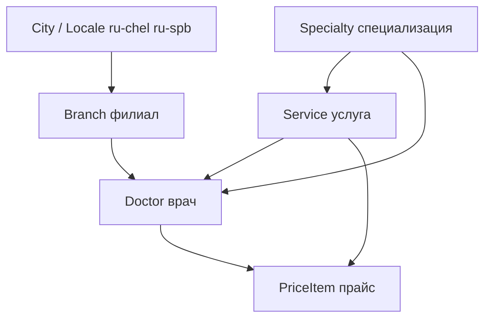

# Онтология контента и процесс синхронизации (2026-06-26)

## Зачем этот документ

Раньше синк шёл «по сущностям legacy как есть» (Doctor flat → Strapi).  
**Новое решение:** сначала **единая модель данных сайта**, потом **маппинг двух городов**, потом **синк**.  
Пилот — **врачи**, потому что через них связаны филиалы, специализации и услуги.

SSOT для сайта: **Strapi**. Bridge — только ETL, не второй CMS.

---

## Три фазы (на каждую группу сущностей)

```
┌─────────────────────────────────────────────────────────────┐
│ 1. МОДЕЛЬ (Strapi + contracts)                              │
│    Типы: справочник | контент | справочник+relation         │
├─────────────────────────────────────────────────────────────┤
│ 2. МАППИНГ (док + JSON в bridge)                             │
│    legacy_id (chel/spb) → canonical field → Strapi field    │
├─────────────────────────────────────────────────────────────┤
│ 3. СИНК (SyncOrchestrator)                                  │
│    порядок: справочники → контент → relations               │
│    idempotent, sync_map, throttle Beget                     │
└─────────────────────────────────────────────────────────────┘
```

---

## Классы сущностей

| Класс | Примеры | На сайте | Используется как FK |
|-------|---------|----------|---------------------|
| **A. Справочник** | Specialty, Branch, PriceCategory | редко отдельной страницей | да |
| **B. Контент** | News, Promotion, Vacancy, Page | полноценные страницы | иногда |
| **C. Гибрид** | Doctor, Service, Program | карточки + детальные | да (Doctor→Branch) |

**Правило:** сущности класса A синкаются **раньше** C; C не хранит дубли текста справочника (только relation или denormalized cache с safe-update).

---

## Граф зависимостей (целевой)



### Филиалы (Branch)

| | Челябинск | Санкт-Петербург |
|---|-----------|-----------------|
| Кол-во | 4 (40 лет Победы, Чичерина, Лесной, ЭКО) | 1 (Финский пер., 4) |
| У врача | признак/список филиалов приёма | один филиал на город → default |
| У услуги/процедуры | может быть привязка к филиалу | тот же default |
| Источник данных | WP REST / MySQL `clinics` | MODX + конфиг |

**Strapi (черновик):** `Branch`: `name`, `slug`, `address`, `city` (enum chel/spb), `misBranchId?`, `legacyId`, `legacySource`.

### Специализации (Specialty)

- ЧЛБ: текст `specialization` у врача + каталог направлений в WP.
- СПб: MODX TV `specintro`, категории услуг.
- **Strapi:** справочник `Specialty` + `Doctor.specialties` (many) или primary + secondary.

### Услуги (Service)

- ЧЛБ: WP post types + REST.
- СПб: MODX templates 6, 32 + `pricelist_items2`.
- Связь: Service ↔ Specialty, Service ↔ Branch (optional), Service ↔ Doctor (many).

### Врачи (Doctor) — пилот

**Уже в Strapi:** flat-поля (`fullName`, `misId`, `legacyId`, `photoUrl`, `specialty` string…).  
**Нужно добавить:** relations `branches`, `specialties`, `services`; rich `bio`/`education` (import-once + `contentLocked`).

Детальный аудит полей: `docs/SYNC_DOCTORS_SPEC.md`.

---

## Порядок внедрения (roadmap)

### Этап 0 — Done ✅

- Bridge stable, LegacyMysqlGateway, SyncOrchestrator, anti-Beget.
- Doctor content-type, flat sync **68 врачей ЧЛБ** + **53 врача СПб** (2026-07-02).
- `/api/catalog/doctors?tenant=chel|spb` на site-ci.
- Branch seed (ЧЛБ филиалы + алиасы ЭКО/косметология), Specialty SSOT, relations врач↔branch/specialty.
- СПб misId: JSON-мап MODX↔QMS **в работе** (ждём proxy-spb.php на ci74 + booking API key).

### Этап 1 — Услуги и прайс (текущий фокус)

**Handoff:** [`docs/HANDOFF_SERVICES_PRICES.md`](./HANDOFF_SERVICES_PRICES.md)

| # | Задача | Артефакт |
|---|--------|----------|
| 1.1 | Квиз + решения по SSOT цены/текста | `docs/SYNC_SERVICES_SPEC.md` (создать) |
| 1.2 | Инвентарь legacy услуг ЧЛБ/СПб | bridge probe + таблица в spec |
| 1.3 | Маппинг `section.val` → категория сайта | дополнить `docs/mappings/qms-sections-inventory.md` |
| 1.4 | Модель Strapi Service / PriceItem | `apps/cms` + contracts |
| 1.5 | Пилот синка одного раздела getPr | `POST /api/sync/.../services` или расширить qms sync |

### Этап 1b — Дозакрыть врачей СПб (параллельно, не блокер услуг)

| # | Задача |
|---|--------|
| 1b.1 | Залить `proxy-spb.php` на ci74.ru/booking/php/ |
| 1b.2 | `QMS_SPB_BOOKING_API_KEY` в Coolify |
| 1b.3 | `spb-doctor-qms-map.json` → ре-синк врачей с qqc |

### Этап 2 — Strapi schema v2 (частично done для Doctor)

| # | Content-type | Relations |
|---|--------------|-----------|
| 2.1 | Branch | locale, city — **done** |
| 2.2 | Specialty | locale optional — **done** |
| 2.3 | Doctor (extend) | branches, specialties — **done** |
| 2.4 | Service | specialties, branches, doctors — **следующий** |

### Этап 3 — Sync v2 (bridge)

| # | Job | Источник |
|---|-----|----------|
| 3.1 | `POST /api/sync/chel/branches` | WP |
| 3.2 | `POST /api/sync/chel/specialties` | WP / REST |
| 3.3 | `POST /api/sync/chel/doctors` v2 | REST + relations |
| 3.4 | то же для spb | MODX MySQL |

### Этап 4 — Контент (news, promotions, …)

Тот же цикл 1→2→3 для News/Vacancy/Promotion (см. таблицу в `WHERE_WE_ARE.md`).

---

## Технические правила синка (не менять)

1. **Один SQL-поток** на Beget (`legacyDbQueue`, delay ≥ 500 ms).
2. **Chunk** max 25 записей.
3. **Mutex** — одна job на `entity:city`.
4. **sync_map** + **sync_runs** в Postgres bridge.
5. **Safe-update vs import-once** — как в `SYNC_DOCTORS_SPEC.md`.
6. Booking/slots — **QMS + REST**, не Strapi.

---

## Что НЕ делать

- Не синкать врачей с relations, пока нет Branch/Specialty в Strapi.
- Не тянуть full-graph MODX на прод без limit/offset.
- Не дублировать логику маппинга в site-ci — только BFF read Strapi.

---

## Связанные файлы

| Путь | Роль |
|------|------|
| `modx_wp-to-strapi-migration-api/server/services/SyncOrchestrator.ts` | Оркестратор (расширять под entity) |
| `modx_wp-to-strapi-migration-api/server/services/DoctorHydrator.ts` | Маппер врача → canonical |
| `modx_wp-to-strapi-migration-api/scripts/analyze-doctor-fields.mjs` | Аудит полей |
| `packages/contracts/src/types/` | SSOT TypeScript для сайта |
| `apps/cms/src/api/doctor/` | Текущая схема Doctor |
