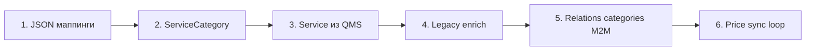

# Услуги и прайс: ЧЛБ + СПб → Strapi

SSOT для витрины: **Strapi** (`Service`, `ServiceCategory`).  
Цена и артикул: **QMS getPr** (`Duv`, `section.val`, `Mr70`, `u`).  
Legacy (WP/MODX): SEO, описания, рубрики, блок «врач + текст» на рубрике.  
Синк: **bridge** (`legacy-bridge-istochnik`) → Strapi. Виджет записи (`/src/widget`) **не трогаем**.

Связанные документы: [SYNC_ONTOLOGY_PLAN.md](./SYNC_ONTOLOGY_PLAN.md), [HANDOFF_SERVICES_PRICES.md](./HANDOFF_SERVICES_PRICES.md), [SYNC_DOCTORS_SPEC.md](./SYNC_DOCTORS_SPEC.md).

**Статус (2026-07-02):** Strapi content-types **`Service`**, **`ServiceCategory`** + компоненты — **созданы** в `apps/cms`. Синк bridge — в очереди.

**Полный аудит всех полей legacy:** [`SYNC_SERVICES_FIELD_AUDIT.md`](./SYNC_SERVICES_FIELD_AUDIT.md) — JSON в `docs/mappings/*-fields-audit.json`.

---

## Решения квиза (зафиксировано)

| Тема | Решение |
|------|---------|
| **Цена на сайте** | QMS по умолчанию; редактор может **зафиксировать** цену в Strapi (`priceLocked`) |
| **Название** | Из QMS при синке; флаг **`titleLocked`** — не перезаписывать |
| **Покрытие QMS** | Все позиции getPr → Strapi; **публикация отдельно**; новые — Studio «тиндер» |
| **Публикация при импорте** | Переносим текущий `published` / `enabled` из legacy |
| **Нет в QMS** | Статус `legacyOnly`, без live-цены или «по запросу» |
| **ЧЛБ 2 org QMS** | Одна витрина `ru-chel`, merge по артикулу `Duv` |
| **Ключ услуги** | 1:1 `Service.article` = `Duv`, уникальность **per locale** |
| **Рубрики** | Единый `ServiceCategory` + JSON-алиасы legacy (СПб/ЧЛБ) |
| **Услуга ↔ рубрика** | **many-to-many** (`Service.categories` ↔ `ServiceCategory.services`) |
| **Вкладки (4 вида)** | Хранить `tabQms` + `tabLegacy`; целевой UI — по `tabQms` |
| **Комплексы** | Одна позиция QMS с ценой + editorial + опц. `includedServices[]` (без цен дочерних на витрине) |
| **Синк цен** | Целевой движок — **Strapi plugin**; bridge — временный ETL |
| **Сброс** | `?mode=soft` (поля safe-update) / `hard` (полный re-import контента) |
| **Врач ↔ услуга** | Фаза 2 (после базового прайса) |

---

## Аудит данных (2026-07-02)

Источник: [`docs/mappings/service-data-probe.json`](./mappings/service-data-probe.json).

### QMS getPr

| Город | Позиций | `section.val` | Транспорт |
|-------|---------|---------------|-----------|
| **СПб** | 2249 | 78 | `spb:site_proxy` ✅ |
| **ЧЛБ** | ~2249 (2 org) | ожидается | bridge **502** — нужен `QMS_CHEL_SITE_PROXY_URL` |

Ключ: **`Duv`** (артикул), цена **`Mr70`**, название **`u`**, раздел **`section.val`**.

Автомаппинг `section.val` → 4 вкладки покрывает ~**72%** (56/78); 22 секции — ручной review → [`docs/mappings/qms-sections-inventory.md`](./mappings/qms-sections-inventory.md).

### Санкт-Петербург — `pricelist_items2`

| Метрика | Значение |
|---------|----------|
| Строк в таблице | 650 |
| Уникальных артикулов | 244 |
| Опубликовано (`published=1`) | 485 |
| Уникальных `category` | **56** |
| Уникальных `tab` | 4 (Приём / Диагностика / Программы / Лечение) |

Пересечение QMS ↔ сайт: **204** артикула на обоих; **2045** только в QMS; **40** только на сайте (legacy-only).

Пример пилота: **Кардиология** — 11 позиций, span двух `tab`.

### Челябинск — `post_type=services`

| Метрика | Значение |
|---------|----------|
| Постов услуг | 1345 |
| С артикулом | 1336 |
| Уникальных артикулов | 1073 |
| `enabled` (в прайсе) | 1300 |
| `item_view=1` (отдельная страница) | 34 |

Контент чаще на **рубрике** `directions`, не на посте услуги.

### Челябинск — taxonomy `directions` (рубрики)

| Метрика | Значение |
|---------|----------|
| Всего терминов | **587** |
| С блоком врача/текста (`doctor_id` + `text`) | **540** |
| Inventory | [`docs/mappings/chel-direction-meta-inventory.json`](./mappings/chel-direction-meta-inventory.json) |
| Probe-пример (Анестезиология, id **569**) | [`docs/mappings/chel-direction-meta-569.json`](./mappings/chel-direction-meta-569.json) |

---

## Целевая навигация (3 уровня)

```
Tab (вид прайса)          → 4 значения: Приём / Диагностика / Программы / Лечение
  └── ServiceCategory     → рубрика с контентом (Кардиология, Анестезиология…)
        └── Service       → 1 позиция QMS (артикул Duv)
```

| Уровень | СПб legacy | ЧЛБ legacy | QMS |
|---------|------------|------------|-----|
| Tab | `pricelist_items2.tab` | JSON `section.val→tab` | `section.val` (через мап) |
| Category | `pricelist_items2.category` | term `directions` | — (нет в QMS) |
| Service | строка прайса + MODX page | post `services` | `Duv` |

---

## Strapi — content-types (черновик)

> В `apps/cms` пока **нет** `Service` / `ServiceCategory` — создать по этой спецификации.

### `ServiceCategory` (рубрика, класс A→C гибрид)

| Поле | Тип | Safe-синк | Import-once | Комментарий |
|------|-----|-----------|-------------|-------------|
| `title` | string | да | — | Название рубрики |
| `slug` | uid | да | — | Из legacy slug |
| `legacyId` | string | да | — | term_id (ЧЛБ) / category name hash (СПб) |
| `legacySource` | enum chel/spb | да | — | |
| `tabQms` | enum (4 вида) | да | — | Целевая вкладка витрины |
| `tabLegacy` | string | да | — | Исходное значение tab (СПб) |
| `parent` | relation → self | да | — | Дерево рубрик (ЧЛБ) |
| `sortOrder` | integer | да | — | `ord` в termmeta / посте |
| `showInMenu` | boolean | да | — | `enabled_menu` |
| `showFaqs` | boolean | да | — | `faqs_view` |
| `showReviews` | boolean | да | — | `reviews_view` |
| `bodyMiddle` | richtext | — | да | `text_middle` |
| `seoText` | richtext | — | да | `seo_text` |
| `phone` | string | — | да | `phone` |
| `clinics` | relation → Branch[] | — | позже | `clinics` (termmeta) |
| `advantages` | component[] | — | да | `advantages` |
| `bannerList` | json/component | — | да | `banner_list` |
| `enabled` | boolean | да | — | Показывать в меню/каталоге |
| `featuredDoctor` | relation → Doctor | да* | — | *Маппинг wp_user/post → Doctor |
| `expertIntro` | richtext | — | **да** | Блок «врач + текст» — поле `text` termmeta |
| `aboutHeader` | string | — | да | `about_header` |
| `aboutText` | richtext | — | да | `about_text` |
| `aboutVideo` | string | — | да | URL видео |
| `seoTitle` | string | — | да | |
| `seoDescription` | text | — | да | |
| `seoText` | richtext | — | да | Нижний SEO-блок |
| `contentLocked` | boolean | — | — | После ручной правки в Studio |
| `services` | relation **manyToMany** → Service | да | — | Обратная сторона `Service.categories` |

**Локаль:** `ru-chel` / `ru-spb` (i18n), как у `Doctor`.

#### Связь Service ↔ ServiceCategory (many-to-many)

Одна услуга может входить в **несколько** рубрик (ЧЛБ: 2017 связей `directions` на 1345 постов; СПб: один `doc_id` в нескольких строках `pricelist_items2` с разными `category`).

| | Источник связей | Правило синка |
|---|-----------------|---------------|
| **ЧЛБ** | `wp_term_relationships` + taxonomy `directions` | Все term_id поста → `categories[]` |
| **СПб** | `pricelist_items2` по `doc_id` | UNION уникальных `category` по артикулу |

**Вкладка (`tabQms`):** берётся из QMS `section.val` (на услуге), не из рубрики. Если одна услуга в рубриках с разными legacy-tab — на витрине фильтр по QMS-tab, рубрики — второй уровень навигации.

**Strapi:** `Service.categories` ↔ `ServiceCategory.services`, `inversedBy` / `mappedBy`.

### `Service` (позиция прайса, класс C)

| Поле | Тип | Safe-синк | Import-once | Комментарий |
|------|-----|-----------|-------------|-------------|
| `article` | string, unique/locale | да | — | **= QMS `Duv`** |
| `title` | string | да** | — | **Из QMS, если не `titleLocked`** |
| `titleLocked` | boolean | — | — | Редактор запретил перезапись |
| `price` | decimal/string | да** | — | Из QMS `Mr70`, если не `priceLocked` |
| `priceLocked` | boolean | — | — | Зафиксированная цена в CMS |
| `qmsSectionVal` | string | да | — | Исходный `section.val` |
| `qmsOrgId` | string | да | — | Для ЧЛБ merge 2 org |
| `legacyId` | string | да | — | post_id / pricelist row |
| `legacySource` | enum | да | — | |
| `categories` | relation **manyToMany** → ServiceCategory | да | — | Все рубрики услуги (см. выше) |
| `tabQms` | enum | да | — | Из QMS `section.val`, не из рубрики |
| `published` | boolean (draft/publish) | да | — | Из legacy `published`/`enabled` |
| `legacyOnly` | boolean | да | — | Нет в QMS |
| `hasDetailPage` | boolean | — | да | ЧЛБ `item_view=1` |
| `slug` | uid | — | да | Для детальных страниц |
| `description` | richtext | — | **да** | Текст услуги (WP/MODX) |
| `seoTitle` | string | — | да | |
| `seoDescription` | text | — | да | |
| `includedServices` | component repeatable | — | да | Комплекс: `text_list` (ЧЛБ), `json_data` (СПб) |
| `includedListTitle` | string | — | да | `text_list_header` (ЧЛБ) |
| `intro` | richtext | — | да | `text_welcome` |
| `summary` | text | — | да | СПб TV `minText` |
| `showFaqs` | boolean | да | — | `faqs_view` |
| `showReviews` | boolean | да | — | `reviews_view` |
| `isTelemedicine` | boolean | да | — | `telemedecine` |
| `legacyDextraId` | string | да | — | `dextra_id` (отладка маппинга) |
| `legacyDextraCategoryId` | string | да | — | `dextra_category_id` |
| `modxResourceId` | integer | да | — | СПб `resource_id` в прайсе |
| `sortOrder` | integer | да | — | `ord` (ЧЛБ), `sorts` (СПб) |
| `externalLink` | string | — | да | СПб `links` в прайсе (редко) |
| `contentBlocks` | component[] | — | да | СПб `first_block_*`, `second_block_*` |
| `faqItems` | component[] | — | да | СПб `faq_services` (MIGX) |
| `contentLocked` | boolean | — | — | |
| `misSyncAt` | datetime | да | — | Последний синк QMS |

**Связанный контент (фаза 2, отдельные content-types):**

| Legacy | Strapi | Связь |
|--------|--------|-------|
| ЧЛБ `vopros_otvet` (3850) | `Faq` | `service_id` редко; чаще через рубрику + `showFaqs` |
| ЧЛБ `otzivi` (1556) | `Review` | в основном `doctor_id` |
| СПб template 12 | `Program` или `Service`+flag | `priceProgramm`, `descriptionProgramm`, `spoiler*` |

**Не дублировать:** фото врача на рубрике — только через `featuredDoctor` → `Doctor.photoUrl`.

### Компонент `IncludedServiceItem` (опционально)

| Поле | Тип | Комментарий |
|------|-----|-------------|
| `service` | relation → Service | Вложенная позиция без своей цены на странице комплекса |
| `label` | string | Override названия в списке |
| `sortOrder` | integer | |

### Enum `PriceTab` (4 вида)

```
priem | diagnostika | programmy | lechenie
```

Display labels — в конфиге темы, не в схеме (Zero Hardcode).

---

## Маппинг legacy → Strapi

### ЧЛБ — `wp_termmeta` рубрики `directions`

Probe: `GET /api/chel/directions/:id/meta` (bridge, после деплоя).

| Legacy (termmeta) | Strapi `ServiceCategory` | Когда |
|-------------------|--------------------------|-------|
| `name`, `slug` | `title`, `slug` | safe |
| `doctor_id` | `featuredDoctor` | safe* |
| `text` | `expertIntro` | import-once |
| `about_header` | `aboutHeader` | import-once |
| `about_text` | `aboutText` | import-once |
| `about_video` | `aboutVideo` | import-once |
| `seo_title` | `seoTitle` | import-once |
| `seo_description` | `seoDescription` | import-once |
| `seo_text` | `seoText` | import-once |
| `enabled`, `enabled_menu` | `enabled` | safe |
| `ord` | `sortOrder` | safe |
| `parent` (term) | `parent` | safe |

\* `doctor_id` на рубрике **569** = `wp_users.ID` **600** (Карнаухова), не post `services`. На сайте может отображаться другой сотрудник (`/sotrudniki/`) — нужен JSON-мап.

Связь услуг с рубриками: все term `directions` поста → `Service.categories[]` (many-to-many).

### ЧЛБ — post `services`

| Legacy | Strapi `Service` | Когда |
|--------|------------------|-------|
| `article` (meta) | `article` | safe |
| `price` | начальная `price` → далее QMS | safe |
| `post_title` | fallback `title` до QMS | import-once |
| `enabled` | `published` | safe |
| `item_view` | `hasDetailPage` | import-once |
| `post_content` | `description` | import-once |
| directions (taxonomy), все term поста | `categories[]` | safe |

### СПб — `pricelist_items2`

| Legacy | Strapi | Когда |
|--------|--------|-------|
| `doc_id` / артикул | `article` | safe |
| `name` | fallback `title` | import-once |
| `price` | начальная `price` | safe |
| `published` | `published` | safe |
| `tab` | `tabLegacy` + `tabQms` (через мап) | safe |
| `category` (все строки с тем же `doc_id`) | `categories[]` (UNION) | safe |
| `resource_id` | `legacyId` (MODX page) | safe |

### QMS getPr → `Service` (safe-update)

| QMS | Strapi | Условие |
|-----|--------|---------|
| `Duv` | `article` | всегда |
| `u` | `title` | если `!titleLocked` |
| `Mr70` | `price` | если `!priceLocked` |
| `section.val` | `qmsSectionVal`, `tabQms` | через JSON-мап |
| org | `qmsOrgId` | merge ЧЛБ |

Позиция есть в QMS, но не на legacy-сайте → создать в Strapi **`published: false`**, показать в Studio «тиндер».

Позиция на legacy, нет в QMS → `legacyOnly: true`, не снимать с публикации автоматически без review.

### СПб — `uslugiPrice` (MIGX) vs `pricelist_items2`

| Источник | SSOT для витрины | Когда использовать |
|----------|------------------|-------------------|
| **`pricelist_items2`** | **да** — цена, `doc_id`, `tab`, `category`, `published` | Синк `Service.article`, `price`, `categories`, `published` |
| **TV `uslugiPrice`** | нет | Только **import-once** в `contentBlocks` / отчёт расхождений, если нет строки с тем же `doc_id` |
| **TV `json_data`** | нет | `includedItems[]` (состав комплекса), резолв `id` → `Service` по legacy MODX id или артикулу |

**Правило:** при синке, если для `doc_id` есть live-строка в `pricelist_items2` — **игнорировать** цены из `uslugiPrice`. MIGX хранить только как fallback для legacy-only страниц без строки прайса.

---

## JSON-маппинги (создать в `docs/mappings/`)

| Файл | Назначение | Статус |
|------|------------|--------|
| `qms-section-to-tab.json` | `section.val` → `PriceTab` | черновик в inventory |
| `chel-direction-doctor-map.json` | `wp_user_id` / sotrudniki slug → Strapi `Doctor.documentId` | **нужен** (600 → ?) |
| `spb-category-aliases.json` | Нормализация имён `category` | нужен |
| `chel-direction-aliases.json` | term_id ↔ canonical category slug | нужен |
| `service-legacy-only-articles.json` | 40 СПб + 9 ЧЛБ без артикула | после review |

---

## Порядок синка



1. **Справочники:** `PriceTab` enum, JSON `qms-section-to-tab.json`.
2. **ServiceCategory:** ЧЛБ `directions` termmeta; СПб уникальные `category` из `pricelist_items2`.
3. **Service shell из QMS:** все `Duv` per locale, `published: false` по умолчанию для новых.
4. **Legacy enrich:** тексты, SEO, `published`, `hasDetailPage`, `featuredDoctor`.
5. **Relations:** many-to-many `Service.categories` ↔ `ServiceCategory.services`, `includedServices`.
6. **Price sync (cron / manual):** обновление `price`/`title` из getPr.

### Эндпоинты bridge (целевые)

```http
GET  /api/chel/directions/:id/meta          # probe termmeta ✅ в коде, нужен деплой
GET  /api/chel/directions/meta/inventory    # сводка рубрик ✅
GET  /api/qms/pricelist?city=chel|spb       # QMS getPr
POST /api/sync/chel/service-categories
POST /api/sync/chel/services
POST /api/sync/spb/service-categories
POST /api/sync/spb/services
POST /api/sync/qms/prices?city=chel|spb&mode=soft|hard
Authorization: Bearer {BRIDGE_API_TOKEN}
```

Правила синка — как у врачей: **идемпотентность**, `sync_map`, throttle Beget (chunk + delay).

---

## Блок «врач + текст» на рубрике (ЧЛБ)

Шаблон WP: **`service-group`**. Данные в **`wp_termmeta`**, не в посте услуги.

Пример: [Анестезиология](https://ci74.ru/katalog/vzroslaya_klinika/anesteziologiya_4/) — term **569**.

| На экране | Источник |
|-----------|----------|
| Фото, ФИО | `featuredDoctor` → Doctor |
| Должность | Doctor.position / specialty |
| Текст «Задача анестезиологии…» | `expertIntro` (поле `text`) |
| Прайс ниже | `Service[]` с taxonomy Анестезиология |

**Важно:** REST `get_doctors` (68 врачей Strapi) **не покрывает** `/sotrudniki/`. Для `doctor_id=600` нужен расширенный маппинг сотрудников или отдельный импорт.

---

## Пилоты

| Город | Рубрика | Зачем |
|-------|---------|-------|
| **СПб** | Кардиология | 2 tab, 11 позиций, типичная MODX-рубрика |
| **ЧЛБ** | Анестезиология (569) | Блок врача + termmeta + 10 услуг |
| **ЧЛБ** | Vivace (косметология) | Контент на term, `item_view=0` у услуг |

Критерий успеха пилота: Strapi отдаёт дерево Tab → Category → Services с ценами из QMS (СПб) и legacy enrich без поломки booking.

---

## Studio «тиндер»

UI в Studio (не в bridge): очередь `published: false` + `misSyncAt` свежий + нет `contentLocked`.

Действия редактора: опубликовать / привязать к рубрике / скрыть / `legacyOnly`.

---

## Блокеры и инфра

| Проблема | Влияние | Действие |
|----------|---------|----------|
| ЧЛБ QMS 502 на bridge | Нет live-цен ЧЛБ | Coolify: `QMS_CHEL_SITE_PROXY_URL=https://ci74.ru/booking/php/proxy.php?endpoint=getPr` + ключ getPr |
| Proxy `Invalid client key` | getPr не отвечает | Проверить `QMS_CHEL_API_KEY` (прайс ≠ booking) |
| Новые эндпоинты `/chel/directions/*/meta` | Probe только локально | **Деплой bridge** |
| `explore.ts` taxonomy `direction` | Неверное имя | Исправить на `directions` |
| Сотрудники `/sotrudniki` | `featuredDoctor` не резолвится | `chel-direction-doctor-map.json` + фаза 2 импорта staff |

**Не блокеры:** 2045 позиций QMS вне legacy-сайта (норма); mock `/prices` на новом фронте.

---

## Команды probe

```bash
# Локально (нужен CHEL_DB_* в infra/env/legacy-bridge-istochnik.env)
cd modx_wp-to-strapi-migration-api
npx tsx scripts/probe-chel-direction-meta-local.mjs 569
npx tsx scripts/probe-chel-direction-meta-local.mjs --inventory

# Через bridge (после деплоя)
node scripts/probe-chel-direction-meta.mjs 569
node scripts/probe-chel-direction-meta.mjs --inventory

# Аудит прайса QMS
node scripts/qms-fetch-pricelist.mjs --city=spb
node scripts/qms-fetch-pricelist.mjs --city=chel
```

---

## Файлы

| Файл | Роль |
|------|------|
| `docs/SYNC_SERVICES_SPEC.md` | Этот документ |
| `apps/cms/src/api/service/` | Strapi Service |
| `apps/cms/src/api/service-category/` | Strapi ServiceCategory |
| `apps/cms/src/components/service/` | Компоненты FAQ, blocks, included |
| `docs/mappings/qms-section-to-tab.json` | Мап section.val → tab |
| `docs/mappings/service-data-probe.json` | Сводный аудит |
| `docs/mappings/chel-direction-meta-inventory.json` | 587 terms, 540 с блоком |
| `docs/mappings/chel-direction-meta-569.json` | Probe Анестезиологии |
| `modx_.../server/services/chelDirectionMeta.ts` | Логика probe termmeta |
| `modx_.../server/routes/chel.ts` | Эндпоинты directions meta |
| `modx_.../server/types/qmsPrice.ts` | Типы синка цен |

---

## Следующие шаги (приоритет)

1. **Деплой bridge** с эндпоинтами `directions/:id/meta`.
2. **Coolify:** proxy ЧЛБ getPr → проверка `GET /api/qms/pricelist?city=chel`.
3. **Strapi:** создать `ServiceCategory`, `Service`, компонент `IncludedServiceItem`.
4. **JSON:** `qms-section-to-tab.json`, `chel-direction-doctor-map.json`.
5. **Пилот синка:** СПб Кардиология + ЧЛБ Анестезиология.
